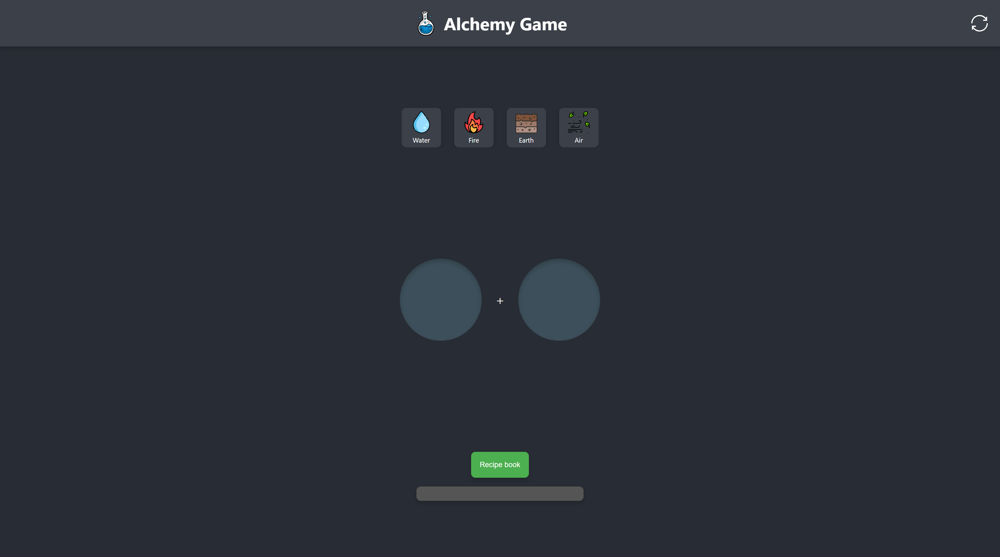
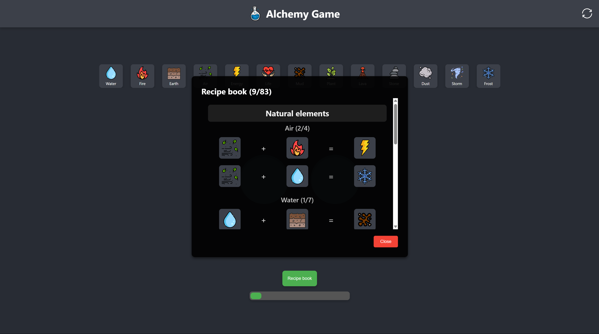

# ⚗️ Alchemy Game

Combine elements by selecting them to discover new ones in this auto-mixing alchemy puzzle game. Experiment with different combinations and unlock every hidden item in the recipe book!

**🔗 Live Demo**: [Alchemy Game](https://dobbyssockk.github.io/alchemy-game/)

---

## 🚀 Features

- Click to select elements and mix them automatically
- 100+ unique combinable items with visual icons
- Interactive recipe book to track discoveries
- Sound feedback on element selection and successful mixes
- Responsive, clean UI that adapts to all screens

---

## 🛠️ Technologies Used

- **HTML5** – semantic layout structure
- **CSS3** – responsive design and styled components
- **JavaScript (ES6+)** – game logic, auto-mixing, element tracking
- **Modules (ESM)** – importable combinations list from `constants.js`
- **Audio** – feedback for user actions
- **PNG icons** – custom visuals for all elements

---

## 💡 Key Concepts

- **Auto-mixing logic**: selected elements are placed and processed automatically
- **Modular architecture**: centralized combination rules for scalability
- **DOM manipulation**: rendering new elements, updating UI and recipe book
- **Game state management**: tracks unlocked items and user progress
- **Interactive feedback**: sound and animation for engagement

---

🎯 _Tip_: Try combining basics like "air" + "fire" to unlock more complex elements!
